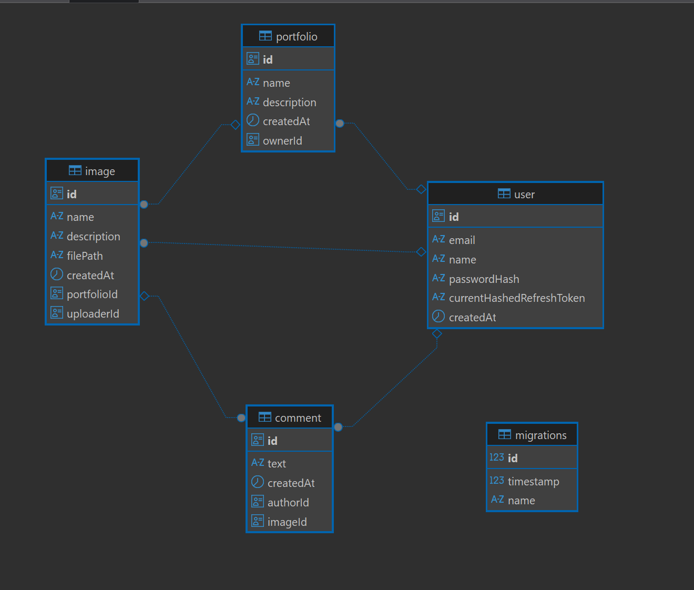

## Description

A portfolio project API built with NestJS framework.

## Quick start:

1. Clone repo into a folder
2. Navigate to the folder and run:

```bash
`npm install`
```

or use `docker-compose up -d --build` to build and run docker containers.

3. Copy`.env`from`.env.example`and set creds
4. Build migrations:`npm run migration:run`(or use TypeORM CLI) 
5.`npm run start:dev`
6. Open`http://localhost:3000/doc`- swagger documentation API
7. Use Postman or similar tool to test API and open `http://localhost:3000/api/`
8. use`https://hoppscotch.io/` and import `nestjs.portfolio.lanars.api.json` configs from root folder to test API

## Features

- User registration and authentication (JWT)
- Image upload and management
- Commenting system for images
- Pagination for images and comments
- Input validation and error handling
- Tests added

## Technologies Used

- NestJS
- TypeORM
- PostgreSQL
- Multer (for file uploads)
- Swagger (for API documentation)

## DB



## License

This project is licensed under the MIT License.
